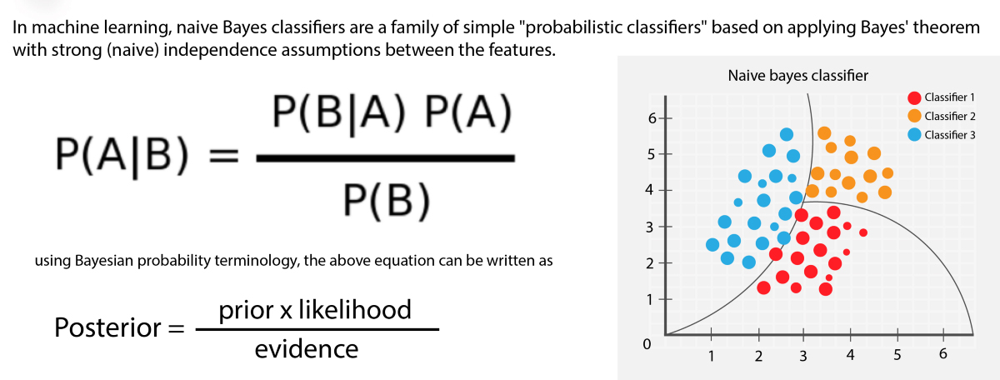

# Twitter-Sentiment-Analysis

    
  

This a project of twitter sentiment analysis using machine learning(Support Vector Machines,Naive Bayes), deep learning(LSTM), Transformer(BERT,ROBERTA).

We know that Twitter is a social media platform. Here everyone can create an account and portrayed their own views. Apparently, we can see that the power of portraying independent views in social media is immeasurable but there are some bad sides too. In some cases, people are conveying their opinion with less research and not knowing the fact on social media. As a consequence people are getting confused about the fact, which information is real and which information is fake.

Goal:
-----

Our goal is to check the sentiment of a tweet over a topic. It can massively be used to check the sentiment of a new product. There are 3 results over the sentiment analysis. The sentiment can be positive, negative, neutral. Based on that result we can analyse the transparency of the new product.

DATASET:
----
The dataset is based on the tweet of Indian Prime Minister Narendra Modi. By using this dataset we will identify the sentiment of common people. Here the number of the tweet is 1,62,981.

"Twitter US Airline Sentiment" Analyze how travelers in February 2015 expressed their feelings on Twitter. Here the number of the tweet is 14,000.

Approach:
----
**_Here there are 3 type of approach._**

├──  **Machine Learning** |-- **SVM , Naive Bayes**

├── **Deep Learning** |-- **LSTM**

├── **Transformer** |-- **BERT, ROBERTA**

Basic Description on Approach:
----

## Machine Learning:

**_SVM_**:

Support Vector Machine or SVM is one of the most popular Supervised Learning algorithms, which is used for Classification as well as Regression problems. However, primarily, it is used for Classification problems in Machine Learning.

The goal of the SVM algorithm is to create the best line or decision boundary that can segregate n-dimensional space into classes so that we can easily put the new data point in the correct category in the future. This best decision boundary is called a hyperplane.

SVM chooses the extreme points/vectors that help in creating the hyperplane. These extreme cases are called as support vectors, and hence algorithm is termed as Support Vector Machine. Consider the below diagram in which there are two different categories that are classified using a decision boundary or hyperplane:

    
  

**_Naive Bayes_**:

Naive Bayes classifier is a probabilistic machine learning model that’s used for classification task. The crux of the classifier is based on the Bayes theorem.

Bayes Theorem:

Using Bayes theorem, we can find the probability of A happening, given that B has occurred. Here, B is the evidence and A is the hypothesis. The assumption made here is that the predictors/features are independent. That is presence of one particular feature does not affect the other. Hence it is called naive.

[**Notebook Link**](https://github.com/soham2707/Twitter-Sentiment-Analysis-/blob/master/tweet_sentiment.ipynb)

## Deep Learning:

**_LSTM_**:

Long Short Term Memory networks – usually just called “LSTMs” – are a special kind of RNN, capable of learning long-term dependencies. They were introduced by Hochreiter & Schmidhuber (1997), and were refined and popularized by many people in following work.1 They work tremendously well on a large variety of problems, and are now widely used.

LSTMs are explicitly designed to avoid the long-term dependency problem. Remembering information for long periods of time is practically their default behavior, not something they struggle to learn!

All recurrent neural networks have the form of a chain of repeating modules of neural network. In standard RNNs, this repeating module will have a very simple structure, such as a single tanh layer.

LSTMs also have this chain like structure, but the repeating module has a different structure. Instead of having a single neural network layer, there are four, interacting in a very special way.

    
  

[**Notebook Link**](https://github.com/soham2707/Twitter-Sentiment-Analysis-/blob/master/LSTM.ipynb)

### NOTE:
Using GRU it is also possible, but this is not discussed here.

## Transformer:

**_BERT_**:

BERT model was proposed in BERT: Pre-training of Deep Bidirectional Transformers for Language Understanding by Jacob Devlin, Ming-Wei Chang, Kenton Lee and Kristina Toutanova. It’s a bidirectional transformer pretrained using a combination of masked language modeling objective and next sentence prediction on a large corpus comprising the Toronto Book Corpus and Wikipedia.

The abstract from the paper is the following:

We introduce a new language representation model called BERT, which stands for Bidirectional Encoder Representations from Transformers. Unlike recent language representation models, BERT is designed to pre-train deep bidirectional representations from unlabeled text by jointly conditioning on both left and right context in all layers. As a result, the pre-trained BERT model can be fine-tuned with just one additional output layer to create state-of-the-art models for a wide range of tasks, such as question answering and language inference, without substantial task-specific architecture modifications.

BERT is conceptually simple and empirically powerful. It obtains new state-of-the-art results on eleven natural language processing tasks, including pushing the GLUE score to 80.5% (7.7% point absolute improvement), MultiNLI accuracy to 86.7% (4.6% absolute improvement), SQuAD v1.1 question answering Test F1 to 93.2 (1.5 point absolute improvement) and SQuAD v2.0 Test F1 to 83.1 (5.1 point absolute improvement).

    
  

    
  

[**Notebook Link**](https://github.com/soham2707/Twitter-Sentiment-Analysis-/blob/master/bert-twitter-sentiment-classifier.ipynb)

**_ROBERTA_**:

Roberta is not described here.

[**Notebook Link**](https://github.com/soham2707/Twitter-Sentiment-Analysis-/blob/master/roberta-sentiment-analysis.ipynb)

Results
-----

|              Algorithm             |                  Accuracy                  |              Dataset Size         |
| -----------------------------------| ------------------------------------------ |-----------------------------------|
|                 SVM                |                   85.47                    |               1,62,981            |
|             Naive Bayes            |                   74.25                    |               1,62,981            |
|            LSTM (20 epochs)        |                   83.71                    |                14,000             |
|           BERT (3 epochs)          |                   97.61                    |               1,62,981            |
|          ROBERTA (3 epochs)        |                   94.19                    |               1,62,981            |

Conclusion:
----

Bert's result is very dependable. It seems Roberta r performence is also good ,but in case of negative tweet it's a disaster. Other side SVM Naive Bayes and LSTM is quite good and fast to training.

Blog:
----
Check out my Medium article ,where I have explained the machne learning part in detail.

[Blog Link](https://nandisoham2017.medium.com/twitter-sentiment-analysis-using-machine-learning-approaches-14fba1b8e357)

Kaggle Link:
-----

Kindly upvote if you like it.

https://www.kaggle.com/soham27/roberta-sentiment-analysis

THANK YOU:
----
